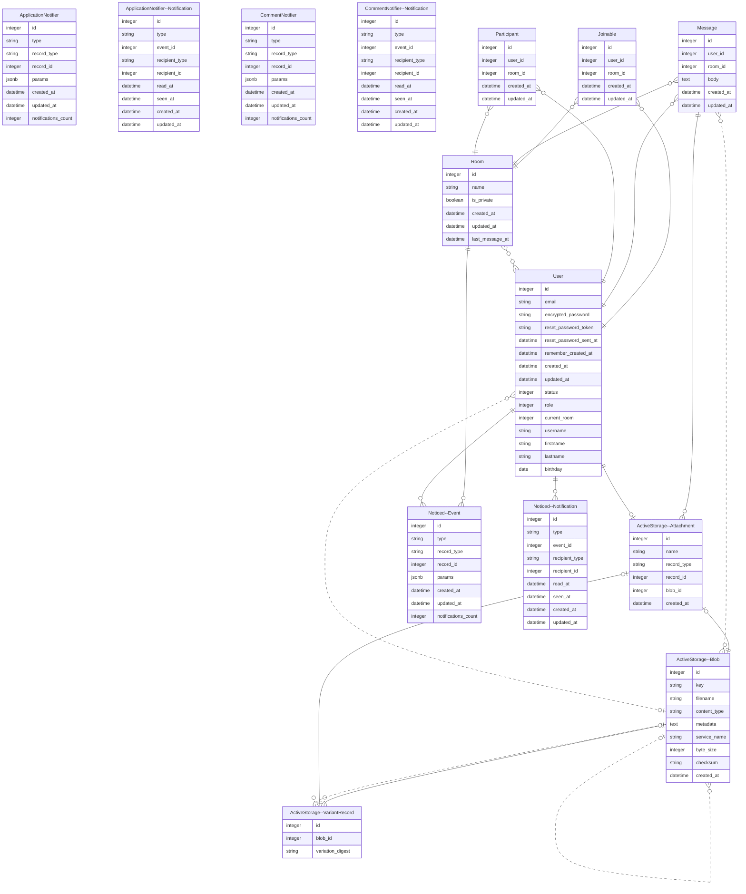

# Turbochat

## Demo
https://github.com/BinhNguyenDang/Demo-Turbochat/assets/146049423/b44c4a06-5c43-4b8b-ad67-e0be8f68b250

# How to Set Up and Run the Application
This guide provides step-by-step instructions for cloning the application repository and running it using Docker Compose.
## Prerequisites
Make sure you have Docker and Docker Compose installed on your machine.
- Docker: https://docs.docker.com/engine/install/ubuntu/ (Example for ubuntu).
- Docker Compose: https://docs.docker.com/compose/install/
## Steps to Clone and Run the Application
1. Clone the Repository
First, clone the repository to your local machine using git:
```
git clone https://github.com/BinhNguyenDang/Docker-Compose-Turbo-chat.git
cd Docker-Compose-Turbo-chat
```
2. Build the Docker Images
Navigate to the root directory of the cloned repository and build the Docker images:
```
docker-compose build
```


3. Start the Services
Start the services defined in the docker-compose.yml file:
```
docker-compose up 
```

Or ( The -d flag runs the services in the background.)
```
docker-compose up -d
```
4. Access the Application
Once the services are running, you can access the application. For example, if your application runs a web server, open your web browser and go to:
```
http://localhost:3000
```
5. Stopping the Services
To stop the services without removing containers, networks, and volumes
```
crtl + c
```


To stop the services and remove the containers, networks, and volumes created by docker-compose up, run:
```
docker-compose down
```


Note: 
Rebuilding Images: If you make changes to your Dockerfiles or dependencies, rebuild the images:
```
docker compose build
```
## Database



## Features

- Real-time Messaging: Utilizes Turbo and Stimulus to provide users with instant messaging capabilities, ensuring fast and responsive communication.
- Chatrooms and Direct Messaging: Users can engage in both group conversations through chatrooms and one-on-one conversations via direct messaging.
- Voice Record function.
- User Status: Displays user status indicators to show availability or activity, enhancing the overall messaging experience.
- ActiveStorage Integration: Implemented ActiveStorage for user avatar and attachment capabilities, allowing users to personalize their profiles and share files seamlessly.
- Search and Joinable Rooms: Users can easily search for and join existing chatrooms, facilitating community engagement and collaboration.
- Admin Functionality: Admin users have the ability to create chatrooms, manage user permissions, and moderate conversations as needed, ensuring a safe and organized messaging environment.
- In chat command function.
- Admin Dashboard with graphing of daily messages.
- User basic info page and recent activities displayed. 
  


